# Volodymyr Burmus - Cognito TicTacToe report

- Course: *Cloud programming*
- Group: PN 11.15
- Date: 08.06

## Environment architecture
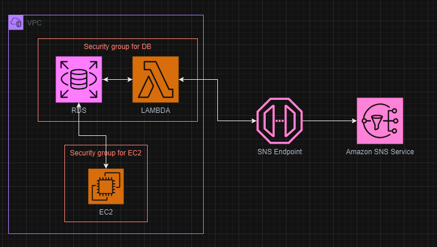
- The architecture consists of the following components:
  - S3 bucket: Used to store the frontend code and assets.
  - RDS instance: Used to store the game state in the game table.
  - Lambda function: Used to handle the game logic and send messages to the SNS topic.
  - SNS topic: Used to send messages to the frontend.
  - VPC Endpoint: Used to allow access to the SNS service from Lambda.
  - Security Group: Used to allow access to the RDS instance from the backend and allow additional traffic to Lambda on 443.
  - EC2 instance: Used to host the backend code and serve the frontend code.
## Preview
 - RDS is used to store the game state. The game state is stored in the game table from backend.
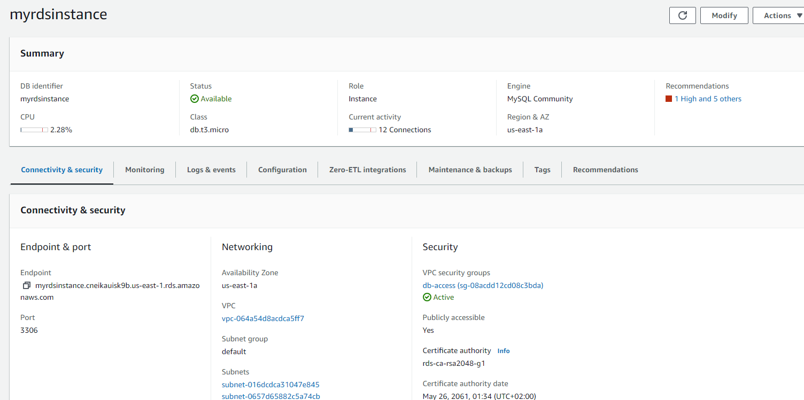
 - Security group is used to allow access to the RDS instance from the backend and allow additional traffic to lambda on 443.
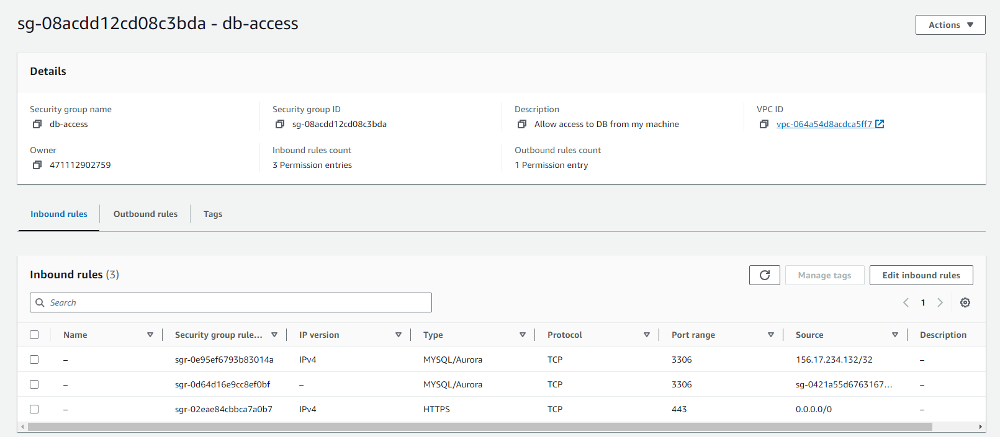
 - VPC Endpoint is used to allow access to the SNS service from Lambda.
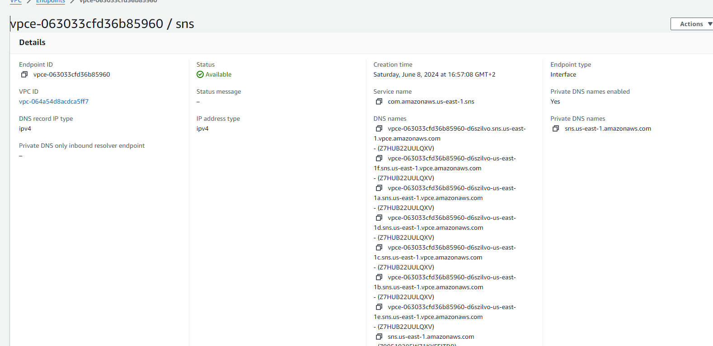
 - Lambda code is used to handle the game logic and to send messages to the SNS topic.
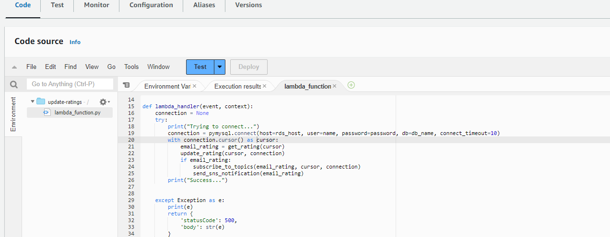
 - Lambda configuration
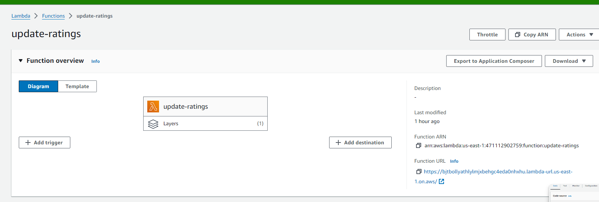
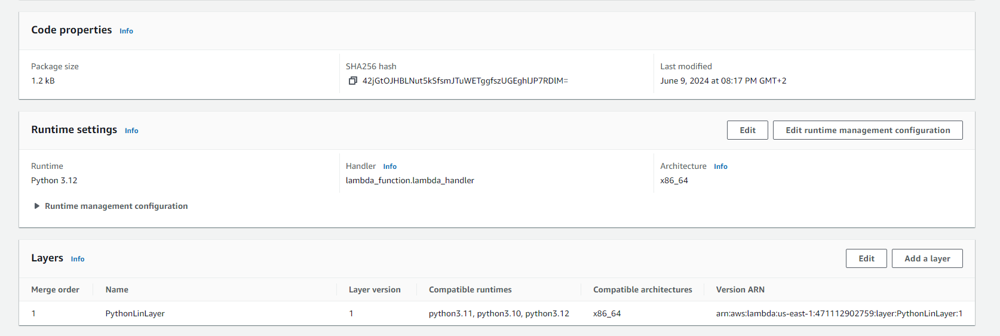

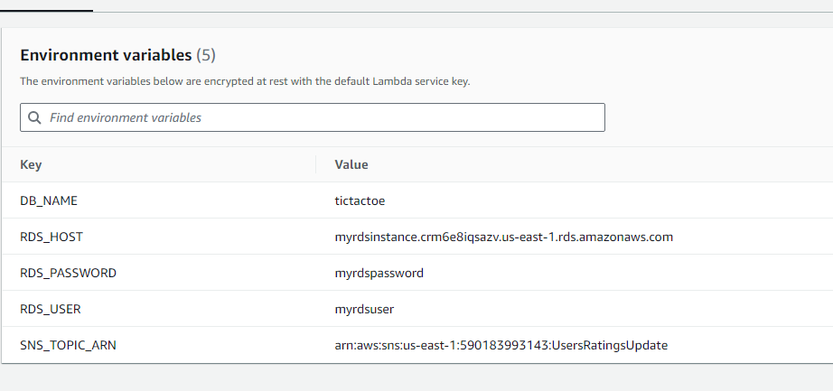
 - SNS topic is used to send messages to the frontend.
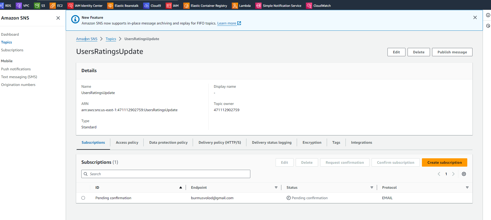
 - EC2 instance is used to host the backend code and serve the frontend code.
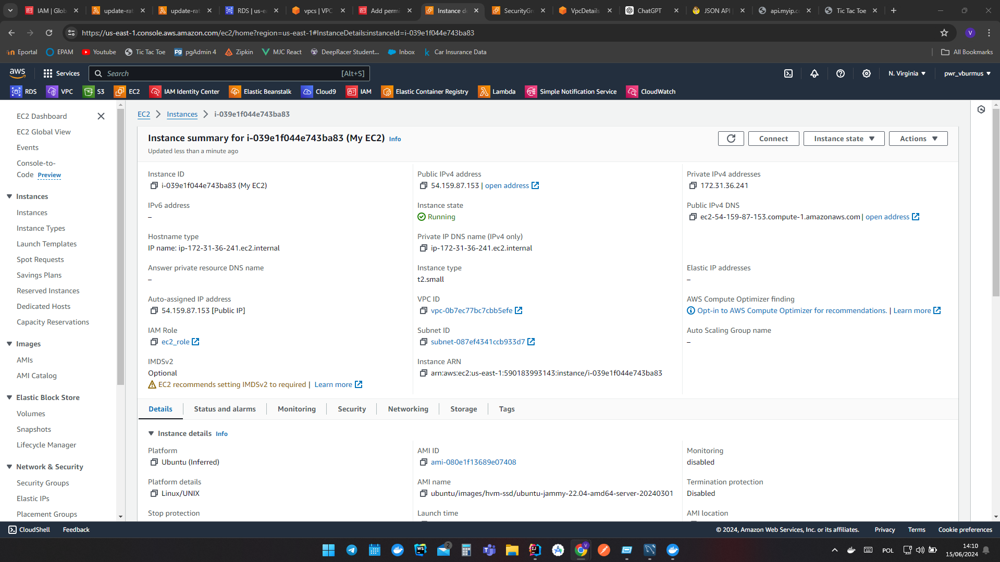
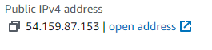
- Application is working as expected.
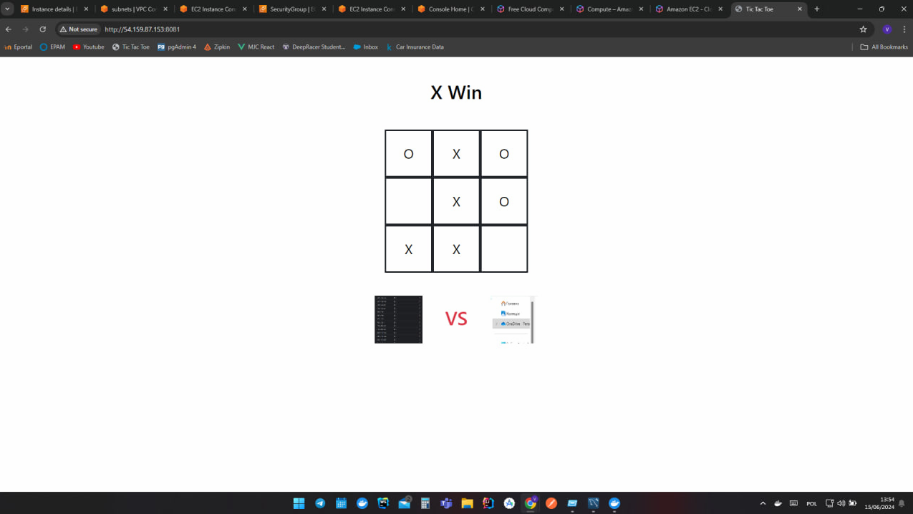
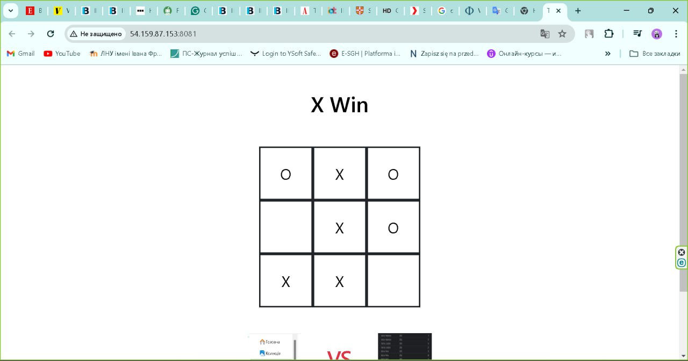
- Docker containers on ec2 instance
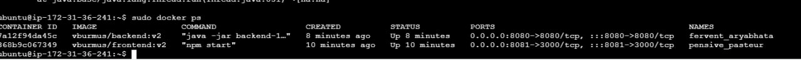
## Reflections

- What did you learn?
  -  I learned how to configure and deploy various AWS services using Terraform, including S3, RDS, Lambda, API Gateway, and SNS.
  - I gained experience in setting up network configurations such as security groups, VPC endpoints, and configuring access controls for 
     different AWS services.
  - I learned how to integrate different AWS services to build a complete application architecture.
- What obstacles did you overcome?
  - I faced challenges in configuring S3 with Terraform due to deprecated functions and IAM policy restrictions.
> **However, I was able to overcome these challenges by researching and using the `aws_s3_bucket_policy` resource to configure the bucket policy and grant permissions to the frontend code.**
  - Setting up the RDS instance with Hibernate and configuring Lambda to interact with both RDS and SNS simultaneously was also challenging.
>  **I debugged connection to the database, firstly tested it from local, then tested from docker containers and then successfully launched it on EC2**
  - Issues with Python imports and layer configurations when integrating Lambda with SNS
> **I had to troubleshoot issues with Python imports and Lambda layer configuration, but eventually, I resolved them by using VPC endpoints and layer for Python in AWS Lambda**
  - When I used instance t2.micro, my application was too slow and it needed more RAM.
> **So I desided to swich to t2.small, also checked others EC2 options to remind myself EC2 types and configs**
- What did you help most in overcoming obstacles?
    - Researching AWS documentation, online resources, and community forums helped me understand the best practices and solutions for 
      configuring AWS services with Terraform.
    - Experimenting with different configurations and testing each component individually helped me identify and resolve issues effectively.
- Was that something that surprised you?
  - Firstly, I was surprised by the complexity of integrating multiple AWS services with Terraform and configuring network settings on Lab 
Account to ensure secure and efficient communication between services. I also found it challenging to troubleshoot issues with Python 
imports and Lambda configurations, but I was able to overcome these challenges through persistence and experimentation.
  - Also, I was surprised by the limitations of Terraform in managing certain AWS services, such as S3, due to deprecated functions and IAM 
    policy restrictions. However, I was able to find alternative solutions and workarounds to address these limitations.
  - Moreover, I was surprised by the importance of setting up VPC endpoints for SNS to allow Lambda to send messages to the SNS topic 
    securely. This configuration was crucial for ensuring that the application architecture was secure and efficient.
  - Finally, I was surprised by the power and flexibility of AWS services and how they can be integrated to build complex and scalable 
    applications. I gained a deeper understanding of how different AWS services work together and how they can be used to create robust and reliable applications.
